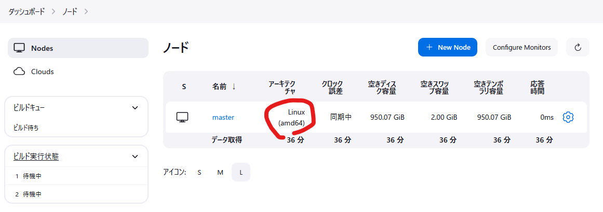
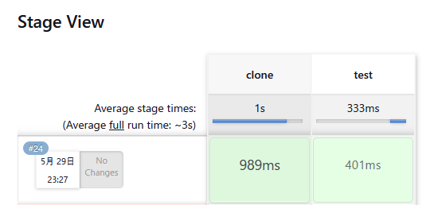

# Jenkinsを学ぼう！

## 準備

### 事前準備
あらかじめ [setup#jenkins](https://github.com/hiroaki-oohata/setup#jenkins) に従ってWSL2にJenkinsをインストールしている必要がある。（アカウント作成も必要）

### Jenkins起動
WSL2でコマンドを実行  
```bash
sudo service jenkins start
```

### Jenkinsアクセス
Windowsのブラウザから以下へアクセス  
http://localhost:8080/  
作成したアカウントでログイン  

## Jobを作成してみよう

### ノード（PC）の確認
まずはビルドが実行されるノード（PC）があるか確認する。
「ビルド実行状態」を押すと登録されているノード（PC）が表示される。
WSL2でJenkinsを起動したノード（PC）が表示されていることを確認する。


## 新規ジョブ作成
「新規ジョブ作成」からジョブを作成してみる。
```
ジョブ名：Sample-pipeline
種類：パイプライン
```

```
General
説明：Jenkins学習用ジョブ - パイプライン
ビルドのパラメーター化
 - テキスト
　 名前：ARG
　 デフォルト値：hoge
                hoge
　 説明：Jenkins学習用ジョブ - パイプライン
パイプライン
　job/Jenkins_learn.groovyを貼り付ける
```
## 実行
「パラメーター付きビルド」でデフォルトのまま実行。  
オールグリーンになることが期待。  



## 答え合わせ
以下のログが出力されていればOK
```
Started by user hiroaki-oohata
[Pipeline] Start of Pipeline
[Pipeline] node
Running on Jenkins in /var/lib/jenkins/workspace/Sample-pipeline
[Pipeline] {
[Pipeline] stage
[Pipeline] { (clone)
[Pipeline] echo
クローンを開始します
[Pipeline] script
[Pipeline] {
[Pipeline] sh
+ pwd
/var/lib/jenkins/workspace/Sample-pipeline
[Pipeline] sh
+ ls -l
total 4
drwxr-xr-x 5 jenkins jenkins 4096 May 28 23:42 SampleProj
[Pipeline] sh
+ [ ! -e Jenkins_learn ]
+ git clone https://github.com/hiroaki-oohata/Jenkins_learn.git
Cloning into 'Jenkins_learn'...
[Pipeline] }
[Pipeline] // script
[Pipeline] echo
クローンが正常終了しました
[Pipeline] }
[Pipeline] // stage
[Pipeline] stage
[Pipeline] { (test)
[Pipeline] sh
+ python3 Jenkins_learn/code/hello.py
Hello World
[Pipeline] echo
テストが正常終了しました
[Pipeline] }
[Pipeline] // stage
[Pipeline] }
[Pipeline] // node
[Pipeline] End of Pipeline
Finished: SUCCESS
```